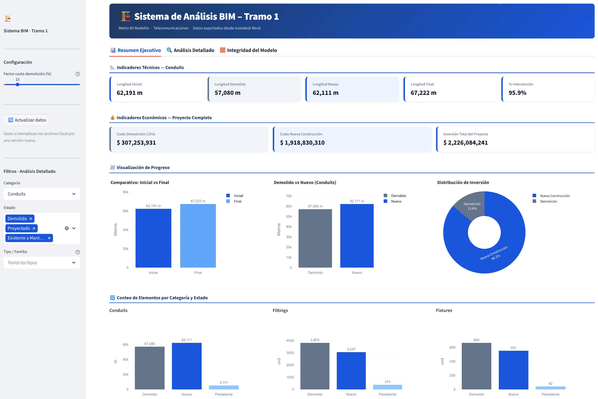
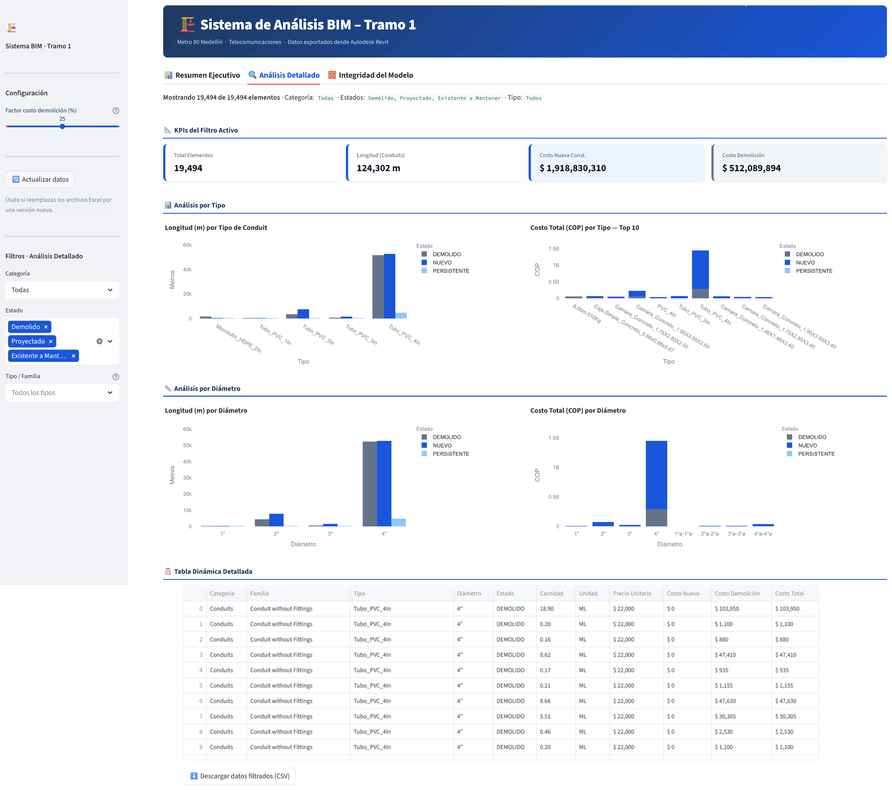
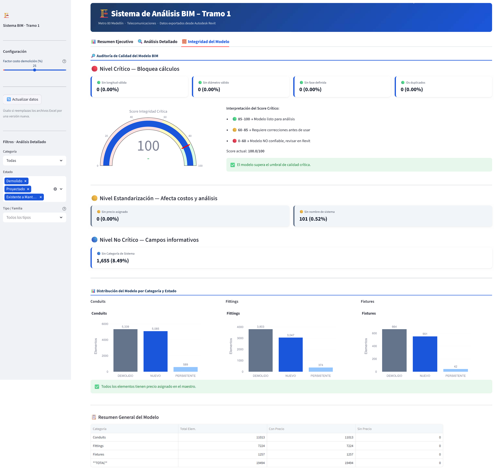

# Metro 80 — BIM Analytics Dashboard


BIM analytics dashboard for **Metro 80 Medellín**, a real telecom infrastructure project. The dashboard processes Revit-exported model data to deliver technical KPIs, cost analysis, and model integrity audits in an interactive interface.

🔗 **Live app:** [metro80-bim-analytics-dashboard.streamlit.app](https://metro80-bim-analytics-dashboard.streamlit.app/)



---

## Overview

A multi-tab Streamlit application that ingests Revit schedules exported as Excel (initial and final states for conduits, fittings, and fixtures) and produces a complete analytical view of the project — from high-level executive KPIs down to per-element cost detail and model quality auditing.

The dashboard processes **19,494 BIM elements** across three categories (Conduits, Fittings, Fixtures), computing initial-vs-final comparisons, demolition vs. new-construction breakdowns, and total project investment with a configurable demolition cost factor.

### Key Features

- **Three analytical views** — Executive Summary, Detailed Analysis, and Model Integrity
- **Configurable cost factor** for demolition (slider) that recalculates all derived metrics in real time
- **Multi-filter pivot table** by category, state (demolished / projected / persistent), and family/type, with CSV export
- **Quality audit engine** with a three-tier scoring system (Critical / Standardization / Informational) and a 0–100 integrity score
- **Interactive Plotly visualizations** — grouped bars, stacked bars, donut charts, and KPI gauges
- **Data validation safeguards** preventing numeric overflow and invalid joins between BIM data and the price master
- **One-click data refresh** when Excel source files are replaced

---

## Tech Stack

| Layer | Technology |
|-------|-----------|
| Language | Python 3.11 |
| Data processing | Pandas, NumPy |
| Visualizations | Plotly Express + Graph Objects |
| Web framework | Streamlit 1.40 |
| Data sources | Excel files exported from Autodesk Revit |
| Hosting | Streamlit Community Cloud |
| Version control | Git + GitHub |

---

## Data Disclosure

The BIM model data exported from Revit corresponds to the **real Metro 80 Medellín telecom infrastructure project**. The master price list (`Maestro_Precios_Tramo1.xlsx`), however, contains **fictional values** created for portfolio purposes — real cost data is confidential and was not used. All cost figures shown in the dashboard are illustrative and do not reflect actual project economics.

---

## Project Structure

```
├── dashboard.py                      # Main application — UI, tabs, and visualizations
├── build_maestro.py                  # ETL script — builds the consolidated master dataset
├── requirements.txt                  # Python dependencies for deployment
├── Maestro_Precios_Tramo1.xlsx       # Price master (fictional values)
├── Tramo1_Conduits_EstadoInicial.xlsx
├── Tramo1_Conduits_EstadoFinal.xlsx
├── Tramo1_Fittings_EstadoInicial.xlsx
├── Tramo1_Fittings_EstadoFinal.xlsx
├── Tramo1_Fixtures_EstadoInicial.xlsx
├── Tramo1_Fixtures_EstadoFinal.xlsx
├── docs/
│   └── images/                       # Screenshots for documentation
└── README.md                         # This file
```

---

## Getting Started

### Prerequisites

- Python 3.11+
- pip

### Installation

```bash
git clone https://github.com/CauseofDeathLife/metro80-bim-analytics-dashboard.git
cd metro80-bim-analytics-dashboard
pip install -r requirements.txt
```

### Run locally

```bash
streamlit run dashboard.py
```

The app opens at [http://localhost:8501](http://localhost:8501).

---

## Dashboard Sections

### Executive Summary

High-level technical and economic indicators for the entire project, with progress visualizations comparing initial vs. final states and demolition vs. new construction across all three element categories.


### Detailed Analysis

Filterable breakdown by category, state, and type. Includes longitude and cost analysis by conduit type and diameter, plus a sortable pivot table with per-element data and CSV export.



### Model Integrity

BIM quality audit organized in three severity tiers — Critical (blocks calculations), Standardization (affects cost and analysis), and Informational. Includes a 0–100 integrity score gauge and a final summary table validating that every modeled element has an assigned price.



---

## Design Decisions

- **Excel-first ingestion:** the dashboard reads directly from Revit-exported `.xlsx` files, mirroring the real workflow of a BIM team rather than requiring a database setup.
- **State-driven cost model:** every conduit, fitting, and fixture is tagged as `Demolido`, `Proyectado`, or `Existente a Mantener` — the cost engine reads these states to compute demolition vs. new-construction figures independently.
- **Configurable demolition factor:** instead of hard-coding the cost of demolition as a fixed percentage, the user can adjust the factor in real time to model different scenarios.
- **Three-tier integrity audit:** separates issues that block calculations (missing length, missing diameter) from issues that only affect downstream analysis (missing price code, missing system name) and from purely informational gaps.
- **Hosted on Streamlit Community Cloud:** chosen over Power BI Service for full reproducibility, code-based version control, and a faster iteration cycle.

---

## Author

**Daniel Quintero** — Senior BIM Modeler · BIM Analyst & Developer

- [LinkedIn](https://www.linkedin.com/in/danielesban/)
- [Linktree](https://linktr.ee/DanielEstebanQuintero)

---

## License

This project is shared for portfolio purposes. The BIM model corresponds to a real project; cost data is fictional.
